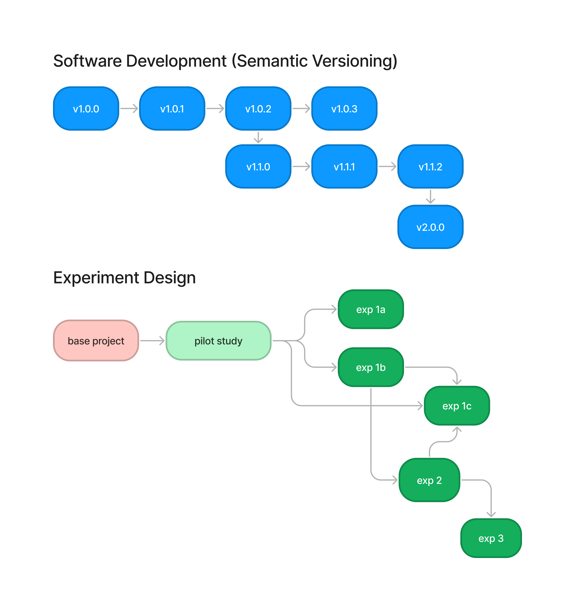
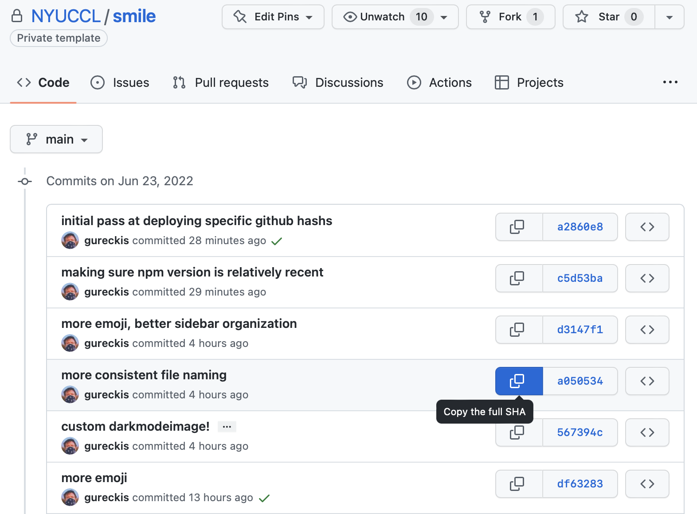
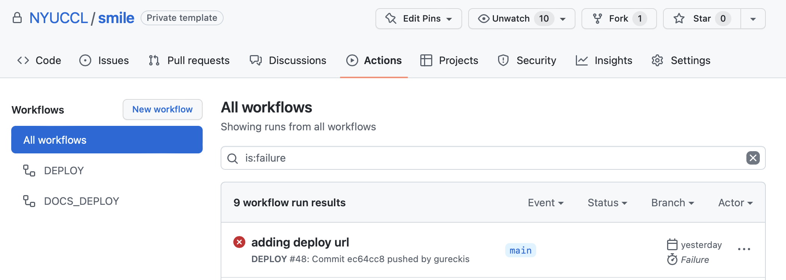

# :cloud: Deploying your experiment

Deploying (or hosting) your experiment involves building the web application and
then transferring a copy of the files to a suitable public website where
participants can access them.

The steps to deploy are...

1. **Use `git` to push changes to a branch of the repo for your project**

In response, GitHub will automatically

1. **Build your project**
1. **Upload your files** to the [configured](/configuration) server location
1. **Notify a bot** in your lab slack (e.g., `#smile-deploy`) about the final
   URL of your project (or if there is an error)


This process provides you with nearly instant feedback on putting your code in
the cloud.

**That's it!** :sweat_smile:

For most people this is all you need to do. But there is more:

- If you have a more complex project with multiple experiments read the section
  on
  [organizing multiple versions of your experiment](#organizing-versions-of-your-experiment).
- If you run into problems try
  [debugging deployment issues](#debugging-deployment-issues).
- If you want to go back in your development history and deploy some older
  version of your code check out
  [this section](#deploying-a-specific-version-of-your-experiment).
- If you just want to understand how this magic works jump to
  [understanding the deployment steps](#understanding-the-deployment-steps).

## What type of commits trigger an automatic deployment?

By default, any commit on any branch that modifies a file in your project will
generate a deployment. The concept here is
"[continuous deployment](https://en.wikipedia.org/wiki/Continuous_deployment)"
where things just are always synced with the online website. The exceptions are:

- Changes that only affect files in the `docs/` directory do not generate a
  deployment.
- Additionally, pushes to branches name either `analysis`, `models`, or `docs`
  will not generate a deployment with the assumption is this is where you can
  track code for these purposes and are not relevant to the deployment logic.

If you would like the deployment workflow to ignore additional files, folders,
or branches see the starting section of `.github/workflows/deploy.yml`.

## Organizing versions of your experiment

Once you start committing changes to your project, one key challenge becomes
dealing with multiple versions of the same experiment:

> Consider this typical research project evolution: First you develop an
> experiment and maybe collect some pilot data. Next, you refine the experiment
> based on the pilot and run a full pre-registered design. Next, you have
> followup questions and run several subsequent versions. The key question is
> which versions should we keep around on the deployment server?

The idea in <SmileText/> is to use the structure of GitHub repos to help
organize the versions of your files as well as keep the data linked to the code
that generated it. To do this we use an adapation of
[semantic versioning](https://semver.org). You've probably seen software with
versions like 1.0.1 or 2.3.12. This is known as semantic versioning and has the
general format `MAJOR.MINOR.PATCH`. Major versions make incompatible API
changes. Minor versions are incremented when you add functionality/features in a
backward-compatible manner. And patches increment when you make
backward-compatible bug features.

The sequential, number-based system makes sense for simple software projects
where there is one "product". However, in behavioral research, we often have
multiple development paths (experiments) and they have conceptual meanings that
are not well served by a numbering system.



Instead, <SmileText/> uses GitHub as a project organizing tool.

### Using GitHub as a project organizing tool

At the top level of GitHub is the **user account**. For example, my username is
`gureckis`.

Within my user account, there are several repositories for different projects.
The idea in <SmileText/> is each new research project gets its own
**repository** (repo).

Within each repo, there is any number of **branches**. Branches are offshoots of
an original code base that can be used for parallel development on a project.
Branches can be merged into one another and shuffled around. However, we will
primarily use them as parallel pipelines capturing different **experiments**. So
conceptually, branches = experiments.

```
gureckis                 <--- github username
├── another_project      <--- repository
│   └── exp1
    └── pilot
└── my_cool_project      <--- repository
    ├── exp1             <--- branches for experiments
    ├── exp2
    ├── exp2b
    └── pilot
```

For each branch, a unique "deploy path" is created which is more or less a URL
path to your code. Example are: `gureckis/another_project/pilot/` or
`gureckis/my_cool_project/exp2b/` which when uploaded to a website turn into
something like `http://exps.gureckislab.org/gureckis/another_project/pilot/`.

So, the steps to make a project are to follow the steps to start a new project
and then use new branches to manage different experiments.

Each time you need a new branch the following commands will help. For example,
to create a new branch call `pilot` we make the branch locally and push it to
the GitHub repo.

```
git branch -m pilot
git push origin -u pilot
```

This generates a deployment which means you'll get a new URL for your project
immediately.

For hand reference if you ever want to delete a branch (e.g., `pilot`) you have
to do this both locally and remotely:

```
git branch -d pilot
git push origin --delete pilot
```

You shouldn't fear making branches for your projects. So `pilot` and `exp1` and
`exp1-pre-pilot` or `exp1b` are all fine.

## What URL do you send participants to?

The default deploy which combines your github username, project, and branch
(e.g., `gureckis/my_cool_project/exp2b/`) turns into something like
`http://exps.gureckislab.org/gureckis/another_project/pilot/` on your website.
One issue is this includes information about yourself and even the location of
your code! As a result <SmileText/> automatically creates a "code name" for your
project. This is a deterministic hash of your project deployment into a string
of readable words (e.g., `hike-shark-kite`). A symbolic link is made to your
normal deploy path on your server automatically. As a results you get a second
URL like `http://exps.gureckislab.org/e/hike-shark-kite`. This code name URL can
be shared publically without exposing information. See configuration options for
more information.

## Deploying a specific version of your experiment

Sometimes it can be helpful to re-deploy an older version of the code (e.g.,
sharing with a reviewer or collaborator). Using GitHub hashes (which index
individual commits) this is possible. Go to your repository on github:
`https://github.com/user/repo/commits/main` (replacing user/repo with your
username and the name of your project repo). This will present you with a list
of past commits you can navigate which looks like this:



Find the commit you want to deploy publically and click the button with two
boxes to copy the full hash value for that commit to your clickboard. Then run
the following command:

```
gh workflow run deploy.yml -f github_sha=XXXXX
```

replacing `XXXXX` with the hash you have in your clipboard (it is a long
sequence of letters and numbers). This will deploy that version of the code to a
special deploy path `hashes/user/project/SHORTHASH/` where `SHORTHASH` is
replaced with the first 7 characters of that hash value you requested. This way
you can share a live link to any arbitrary and specific version of the code with
people.

## Debugging deployment issues

Sometimes a deployment can fail due to an error in your code or your setup. When
possible an error message will be posted to `#smile-deploy` by the slack bot.
However, sometimes even this fails. In any case, if you don't get a notification
that your app deployed here are some useful hints for fixing things.

First, check the `#smile-deploy` slack channel and see if there are any relevant
messages.

Second, make sure you have a set of `.env.*.local` files in the `env/` folder
(created using `git secret reveal`) and have run the `npm run upload_config`
command (refer back to the [initial setup instructions](starting)). This latter
command uploads some specific configuration options to GitHub which are needed
for your deployment to run. You can verify these have been set by going to your
repository on the GitHub website, clicking Settings, then "Secrets". There
should be several repository secrets including `SECRET_APP_CONFIG` and
`EXP_DEPLOY_PATH`, etc...

Third, run the `npm run build` and `npm run preview` commands and verify that
these steps are completed without error on your local machine. If there are
errors they may be preventing GitHub from building your site. Fix the errors
locally and push the changes.

Finally, go to the GitHub repo for your project on the github.com website and
click the "Actions" tab. This will show a history of recent "workflow" runs.
Runs that fail will have a red :x: next to them. Clicking on this will lead to a
"transcript" of the run which can provide some debugging hints.



## Understanding the deployment steps

Deployment is **continuous and automatic** by design. The purpose of continuous
deployment is so that new changes to the code are always placed into a live
server environment (which is then helpful for [integration testing](/testing)).
The purpose of automating deployment is to make it one less thing you need to
think about. However, if something goes wrong, or you need to customize things,
it can be helpful to understand the steps.

Deploying a website involves several steps: triggering the GitHub Actions
deployment process, configuring the site, building the site, and uploading the
files to a suitable internet-accessible server.

### The Github Actions deployment trigger

GitHub Actions are a feature of GitHub that allows customizable scripts to run
on a cloud computer instance whenever certain events happen on a repository.
Examples include running a script when someone leaves a comment on a repo or
opens a pull request. Scripts can also run automatically anytime a push is made
to the repository. In the case of Smile the deployment script is triggered with
any push to the repository excluding the documentation folder (`docs/`). This
runs the action located at `.github/workflows/deploy.yml`. Even without a lot of
knowledge about GitHub action you can read this script and understand the basic
logic.

### Building the site

The first step of the GitHub action runs a sequence of shell commands on a Linux
cloud instance hosted by GitHub (`runs-on: ubuntu-latest`). Next, the current
version of the code (after the commit) is checked out using git.

Next, several scripts run to optimize the environment for the app and configure
it. Then relevant software is installed such as Node.js. The node dependencies
are then run using `npm install`. Then the website is built `npm run build`. The
completed website is located at `dist/`.

You can run most of the steps up to this point locally by just typing
`npm run build`.

### Uploading files to an Internet-accessible server

Next, the GitHub action uploads the files to the server using rsync. The remote
host, folder, and other options are set using GitHub Secrets which are encrypted
environment variables that you configure on the repository settings. Generally
these will be set for you when your [lab base repo](/labconfig) is configured,
but read more about [configuration options](configuration) to customize or
adjust.

### Notifying the Slack bot

If you set up the Slac connection, the final step is to send a notification
about the deployment to a Slack
[Workflow Builder](https://slack.com/help/articles/360035692513-Guide-to-Workflow-Builder)
bot. This lets you verify the code was deployed and provides you with an
up-to-date URL to share with participants. This includes a QR code which can be
used to recruit anonymous participants to the task via a physical flye/poster.

If the deployment script fails, GitHub will attempt to notify the slack bot
about the error. However, it requires that the GitHub secrets have been properly
uploaded with `npm run upload_config` so the absence of an error notification
isn't proof things did work.

## Blocking web crawlers

It usually makes sense not to have Google and other search engines index your
experiment deployments. For this we recommend installing a
[robots.txt](http://www.robotstxt.org) file at the root folder of your web
server containing the following:

```
User-agent: *
Disallow: /
```

In addition, the `index.html` of your project should include the `noindex` meta
field:

```
<meta name="robots" content="noindex">
```

Google offers a
[robots.text testing tool](https://www.google.com/webmasters/tools/robots-testing-tool)
which can verify that your settings will be respected by at least Google.

## Deploying in development mode

In some cases it might be helpful to deploy a live version of your project in
[developer mode](/developing). This will allow you to share a version of your
experiment with other people with the
[developer bar](/developing.html#smile-developer-bar) enabled. To do this create
a new branch for public sharing. Then edit `src/core/config.js` so that the line
the by default reads

```
    mode: import.meta.env.MODE,
```

says instead

```
    mode: "development",
```

## Anonymous deployment

You can deploy your experiment in anonymous mode. In this mode, all  <SmileText/>-default 
references to the organization conducting the study are removed. You can then attach an 
anonymous link to a paper submisison, either by registering another domain or by using
an easy hosting solution such as [netlify](https://www.netlify.com/) or [vercel](https://vercel.com/).
